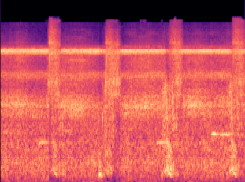

# In pursuit of COVID-19 through cough analysis

<p align="center">

</p>

Identificar sonidos es algo que el ser humano hace de manera muy rápida, y durante los últimos años los ordenadores están ganando cada vez más experiencia en la misma tarea.

Con la emergencia de la COVID-19 están surgiendo una gran cantidad de proyectos que intentar identificar si una persona está afectada por esta enfermedad; uno de los ejemplo es hacer uso de de las toses de sujetos afectados y sanos para poder hacer una clasificación. 

Una de las maneras de clasificar sonidos es a través de clasificación de imágenes. Para ello esta prueba de concepto va a hacer uso de la potencia de  modelos convolucionales ya entrenados y, mediante fine-tuning, conseguir buenas precisiones en nuestra tarea ahorrando tiempo de entrenamiento. 

Nuestra meta, como hemos comentado, es clasificar sonidos en base a unas etiquetas ya asignadas. El problema actual reside en la ausencia de datasets. No contamos con un dataset de calidad, única y exclusivamente compuesto por toses, que nos permita determinar la afección que sufre una persona. 

## Dataset

El único dataset que tenemos disponible hasta ahora es uno liberado por la farmacéutica Pfizer, llamado **Sick Sounds**, que se puede encontrar en el [siguiente enlace](https://osf.io/tmkud/wiki/home/). 
Este dataset separa a los audios entre personas enfermas y no enfermas en dos carpetas distintas. Sin embargo cuando uno profundiza en los audios obtenidos, se ve que las clases están un poco desbalanceadas y que los audios catalogados como "no enferma" en realidad no son audios de toses, sino de música, risas, conversaciones y un largo etcétera de diferentes situaciones.

Sin embargo podemos tomar este dataset como una primera referencia para intentar ver si conseguimos una buena precisión clasificando audios usando redes neuronales convolucionales.

## Características

Hay muchas características qué podemos usar para entrenar un modelo. En lo referente al campo de speech recognition, podemos usar los **Mel-Frequency Cepstral Coefficients** (**MFCC**). Lo mejor de este tipo de coeficientes es que nos dan una buena representación del audio original.


Sería conveniente también tener más información más allá de las características obtenidas de MFCC, pero las redes llamadas *WaveNet* pueden ser muy difíciles de entrenar y también de ejecutar. Por ello vamos a usar espectrogramas. En investigación de audios, un espectrograma se considera como una representación gráfica de un audio que tiene la frecuencia en el eje de ordenadas y el tiempo en eje de coordenadas y una tercera dimensión - con colores - que representa la intensidad del sonido para cada tiempo y cada frecuencia. Aquí tenemos un ejemplo de un espectrograma.

<p align="center">

</p>

Lo mejor del uso de los espectrogramas es que nos permite cambiar **de un problema de reconocimiento de audio a un problema de reconocimiento de imágenes**.
Pasar de audio a imagen es bastante sencillo. Aquí tenemos un simple script que nos permite obtener el espectrograma de un audio, usando la librería `librosa`.

## Fine-tuning con Redes Neuronales Convolucionales

### Entrenamiento
Una vez que hemos conseguido que nuestros audios queden representados como imágenes, podemos proceder a su **clasificación** haciendo uso de redes neuronales. Para ello vamos a usar una red convolucional ya entrenada.

Recomendamos ejecutar el código en un `virtualenv` o `conda environment`:

```bash
$ conda env create -f environment.yml
```

Si tuviéramos que entrenar una red convolucional desde cero nos llevaría bastante tiempo realizar está tarea y dada la calidad de nuestro dataset con total seguridad acabaríamos con un problema de sobreajuste en nuestros datos.

Para ello vamos a usar **Transfer Learning**, el cual nos permitirá hacer uso de una red neuronal ya entrenada con datasets similares y re-entrenar unas pocas capas densas al final de toda la parte convolucional, basadas en nuevas categorías.

**Google** lanzó en su día un modelo presentado llamado [Inception](https://github.com/google/inception) entrenado para clasificar imágenes del [ImageNet dataset](http://www.image-net.org/). De hecho la gente de Tensorflow facilita un script para poder hacer un fine-tuning de inserción con nuevas categorías.

Para obtener este script simplemente ejecutamos el siguiente comando:

```bash
$ curl -O https://raw.githubusercontent.com/tensorflow/tensorflow/r1.1/tensorflow/examples/image_retraining/retrain.py
```

Una vez que tengamos todas nuestras imágenes espectrogramas ordenadas en carpetas en función de si el sujeto está enfermo o no, podemos lanzar nuestro re-entrenamiento:

```bash
$ python retrain.py \
  --bottleneck_dir=bottlenecks \
  --how_many_training_steps=40000 \
  --model_dir=inception \
  --summaries_dir=training_summaries/basic \
  --output_graph=retrained_graph.pb \
  --output_labels=retrained_labels.txt \
  --image_dir=melspectrograms/train

```

En paralelo en otro terminal podéis ejecutar el comando:

```bash
$ tensorboard --logdir training_summaries
```

Para monitorizar el entrenamiento de la red a través de tensorboard a través de nuestro navegador (a través de http://localhost:6006/).

Tras haber entrenado nuestro modelo, se ha obtenido una precisión aproximada del 78% (como se ve, es mejorable).


## Frontal Web 

Se ha trabajado en la construcción de un frontal Web muy rudimentario que nos permita servir a través de un navegador audios que nos permita dar los siguientes pasos:
1. Transformar a imágenes (espectrogramas) 
2. Testearlos contra nuestra red neuronal
3. De esta manera obtener por terminal un score de salud del individuo con la estructura 
```python
{
    "Diagnóstico": "sick" | "not sick", 
    "score": any float in interval 0.0 - 1.0
}
```

### Levantando la página web en local

Se ha optado por una Flask Webapp. Para iniciarla, dentro del entorno virtual correcto, símplemente ejecutar:

```bash
$ python app.py
```

Tras ejecutar este comando se levantará un servidor al que se puede acceder a través de la ruta:

```bash
http://localhost:5000/
``` 
Aquí se incluye [un vídeo con una breve demo](https://youtu.be/5pAZxlWM6do).


## Siguientes pasos

* Encontrar un dataset real de toses y sonidos respiratorios que nos permita construir un modelo de mejor calidad.
* Trabajar en un mejor fine-tuning del modelo para mejorar la precisión.
* Investigar [**WaveNet**](https://deepmind.com/blog/article/wavenet-generative-model-raw-audio) como una opción para entrenar un nuevo modelo.